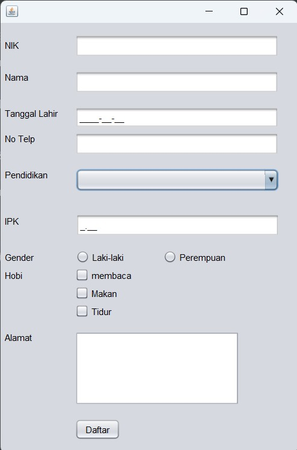
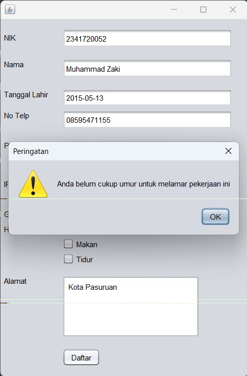
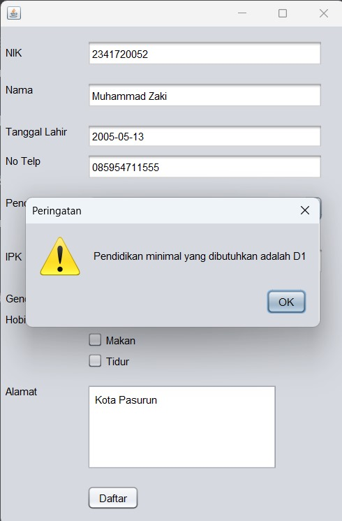
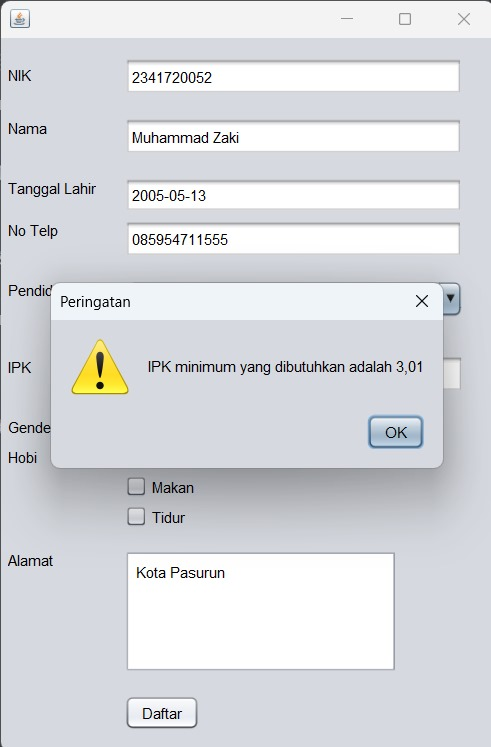
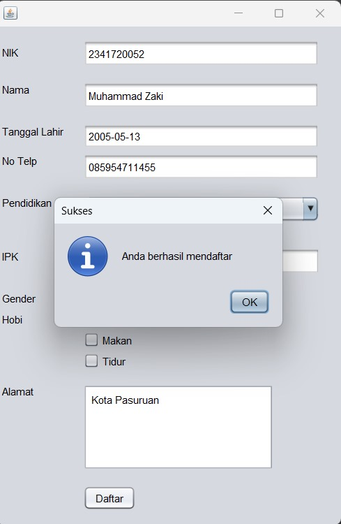

## SOAL:
Buatlah sebuah aplikasi untuk memasukkan biodata pribadi yang digunakan untuk melakukan pendaftaran untuk melamar pekerjaan dengan syarat sebagai berikut:
1. Isian biodata pribadi seperti, NIK, Nama, Alamat, Jenis Kelamin, Hobby, No Telp
2. Sudah berusia lebih dari 18 tahun, dengan mengisikan tanggal lahir
3. Pendidikan minimal D1 dengan IPK minimal 3,01

## Output
1.Tampilan awal :

2. Ketika belum cukup umur :

3. Ketika tidak memenuhi syarat pendidikan :

4. Ketika tidak memenuhi syarat minimu IPK :

5. Ketika Berhasil :
